# Laporan Praktikum Sistem Operasi Modul 3

| Nama | Marvelino Davas |
|------|-----------------|
| NRP  | 5027241085      |

---

## Soal 1 - Present Day, Present Time

### Penjelasan

Program ini mengimplementasikan chat server bernama **The Wired** menggunakan TCP Socket. Ada dua program yang dibuat: server (`wired.c`) dan client (`navi.c`), dengan shared definitions di `protocol.h` dan `protocol.c`.

**protocol.h** berfungsi sebagai file shared yang dipake bareng wired.c dan navi.c. Isinya konstanta koneksi, konstanta admin, dan prototype fungsi logging.

```c
#define PORT 8080
#define ADMIN_NAME "The Knights"
#define ADMIN_PASSWORD "protocol7"
#define LOG_FILE "history.log"

void write_log(const char *level, const char *message);
```

**protocol.c** berisi implementasi `write_log` untuk logging ke `history.log` sesuai poin 7. File dibuka mode append supaya log tidak pernah ketimpa.

```c
void write_log(const char *level, const char *message) {
    FILE *f = fopen(LOG_FILE, "a");
    if (!f) return;

    time_t now = time(NULL);
    struct tm *t = localtime(&now);
    char timestamp[32];
    strftime(timestamp, sizeof(timestamp), "%Y-%m-%d %H:%M:%S", t);

    fprintf(f, "[%s] [%s] [%s]\n", timestamp, level, message);
    fclose(f);
}
```

**wired.c** adalah server yang menggunakan `select()` untuk I/O multiplexing sesuai poin 3, sehingga satu thread bisa handle banyak client sekaligus tanpa fork. Setiap client punya state machine sendiri dengan empat tahap:

```c
#define STATE_WAIT_NAME 0
#define STATE_WAIT_PASS 1
#define STATE_CONNECTED 2
#define STATE_ADMIN     3
```

Switch berikut yang menentukan handler mana yang dipanggil berdasarkan state client:

```c
switch (clients[idx].state) {
    case STATE_WAIT_NAME: handle_wait_name(idx, buf); break;
    case STATE_WAIT_PASS: handle_wait_pass(idx, buf); break;
    case STATE_CONNECTED: handle_connected(idx, buf); break;
    case STATE_ADMIN:     handle_admin(idx, buf);     break;
}
```

Fungsi `broadcast` mengimplementasikan poin 5, mengirim pesan ke semua client CONNECTED kecuali pengirimnya sendiri:

```c
static void broadcast(const char *msg, int exclude_fd) {
    for (int i = 0; i < n_clients; i++) {
        if (clients[i].fd != exclude_fd && clients[i].state == STATE_CONNECTED)
            send_msg(clients[i].fd, msg);
    }
}
```

Fungsi `name_taken` mengimplementasikan poin 4, memastikan nama setiap client unik:

```c
static int name_taken(const char *name) {
    for (int i = 0; i < n_clients; i++)
        if (strcmp(clients[i].name, name) == 0) return 1;
    return 0;
}
```

Handler admin sesuai poin 6, jika nama yang masuk adalah `The Knights` maka server minta password. Kalau salah langsung disconnect:

```c
if (strcmp(buf, ADMIN_NAME) == 0) {
    clients[idx].state = STATE_WAIT_PASS;
    send_msg(fd, "Enter Password: ");
}

// kalau password salah
send_msg(fd, "[System] Authentication Failed.\n");
remove_client(idx);
```

Main loop server menggunakan `select()` untuk memantau semua fd sekaligus:

```c
while (1) {
    fd_set read_fds = master_fds;
    if (select(max_fd + 1, &read_fds, NULL, NULL, NULL) < 0) continue;

    for (int fd = 0; fd <= max_fd; fd++) {
        if (!FD_ISSET(fd, &read_fds)) continue;

        if (fd == server_fd) {
            int new_fd = accept(server_fd, ...);
            FD_SET(new_fd, &master_fds);
        } else {
            int n = recv(fd, buf, sizeof(buf) - 1, 0);
            if (n <= 0) { handle_disconnect(idx); continue; }
            switch (clients[idx].state) { ... }
        }
    }
}
```

**navi.c** adalah client yang menggunakan dua pthread sesuai poin 2. Main thread baca input keyboard dan send ke server, recv_thread terus recv dari server dan print ke layar:

```c
pthread_t tid;
int err = pthread_create(&tid, NULL, recv_thread, NULL);
if (err != 0) {
    printf("\nThread can't be created : [%s]", strerror(err));
    return -1;
}
pthread_detach(tid);
```

Kalau server disconnect, recv_thread mendeteksi dan program exit:

```c
static void *recv_thread(void *arg) {
    while (running) {
        int n = recv(sock_fd, buf, sizeof(buf) - 1, 0);
        if (n <= 0) { running = 0; exit(0); }
        printf("%s", buf);
        fflush(stdout);
    }
    return NULL;
}
```

### Cara Penggunaan

```bash
# Compile
gcc wired.c protocol.c -o wired -pthread
gcc navi.c protocol.c -o navi -pthread

# Terminal 1 - jalankan server
./wired

# Terminal 2, 3, dst - jalankan client
./navi
```

### Output

1. Server berhasil dijalankan (poin 1 - koneksi stabil lewat PORT yang didefinisikan di protocol.h)

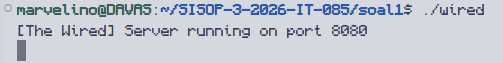

2. Client konek dan muncul welcome message (poin 2 - client NAVI berhasil terhubung ke server)

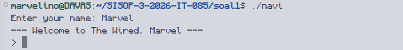

3. Broadcast pesan antar client (poin 5 - pesan dari alice muncul di terminal lain)

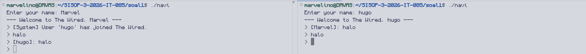

4. Nama duplikat ditolak (poin 4 - identitas unik, tidak bisa ada dua client dengan nama sama)

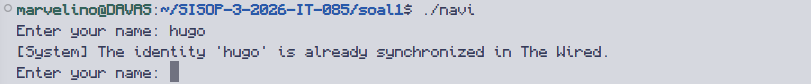

5. Admin login berhasil dan muncul menu THE KNIGHTS CONSOLE (poin 6 - autentikasi admin)

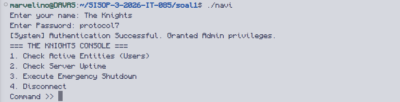

6. Admin RPC check active users dan uptime (poin 6 - fungsi RPC GET_USERS dan GET_UPTIME)

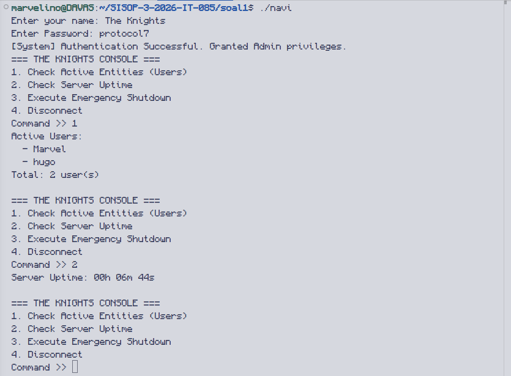

7. Emergency shutdown memutus semua client (poin 6 - fungsi RPC SHUTDOWN)

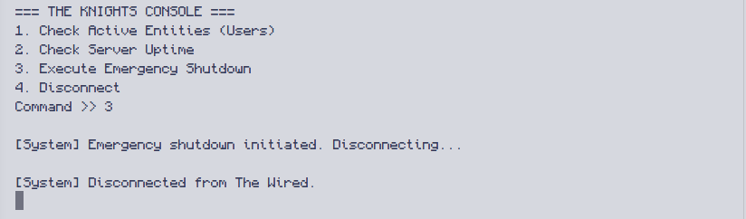

8. Isi history.log dengan format timestamp (poin 7 - logging semua event)

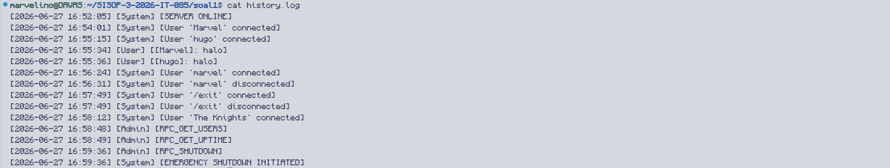

### Kendala

Terdapat error kompilasi karena `SO_REUSEPORT` tidak tersedia di beberapa versi Linux/WSL. Solusinya menghapus `SO_REUSEPORT` dan hanya menggunakan `SO_REUSEADDR` pada `setsockopt`.

---

## Soal 2 - The Battle of Eterion

### Penjelasan

Program ini mengimplementasikan game RPG battle berbasis terminal bernama **Battle Eterion**. Server (`orion.c`) menangani seluruh logika game, sementara client (`eternal.c`) menyediakan antarmuka pengguna. Semua definisi ada di `arena.h`. Komunikasi antara keduanya menggunakan IPC, bukan socket.

**arena.h** berisi semua definisi yang dipake bareng orion dan eternal. Tiga IPC key sesuai poin 1:

```c
#define SHM_KEY   0x00001234  // Shared Memory
#define MSG_KEY   0x00005678  // Message Queue
#define SEM_KEY   0x00009012  // Semaphore
```

Struct `Player` menyimpan semua data akun. Field persistent disave ke file, field runtime di-reset tiap orion restart:

```c
typedef struct {
    char     username[64];
    char     password[64];
    int      gold, lvl, xp;
    int      weapon_idx;
    MatchEntry history[MAX_HISTORY];
    int      history_count;
    // Runtime fields
    int      active;
    pid_t    pid;
    int      in_battle, in_mm, battle_idx;
} Player;
```

Struct `Message` mengatur routing pesan lewat mtype sesuai poin 3. Request dari eternal ke orion pake mtype = 1, balasan dari orion ke eternal pake mtype = PID eternal:

```c
typedef struct {
    long   mtype;
    int    req_type;
    int    res_type;
    pid_t  pid;
    int    value;
    char   username[64];
    char   password[64];
    char   data[256];
} Message;
```

Semaphore helpers untuk proteksi shared memory sesuai additional notes soal:

```c
static inline void sem_lock(int semid) {
    struct sembuf sb = {0, -1, 0};
    semop(semid, &sb, 1);
}

static inline void sem_unlock(int semid) {
    struct sembuf sb = {0, 1, 0};
    semop(semid, &sb, 1);
}
```

**orion.c** adalah server game. Fungsi `save_players` dan `load_players` handle persistent data sesuai poin 4. Sebelum disave, runtime field di-reset ke 0:

```c
void save_players() {
    FILE *f = fopen(PLAYER_FILE, "wb");
    if (!f) return;
    fwrite(&shm->player_count, sizeof(int), 1, f);
    for (int i = 0; i < shm->player_count; i++) {
        Player tmp = shm->players[i];
        tmp.active = 0; tmp.in_battle = 0;
        tmp.in_mm  = 0; tmp.pid = 0; tmp.battle_idx = -1;
        fwrite(&tmp, sizeof(Player), 1, f);
    }
    fclose(f);
}
```

Fungsi `h_register` membuat akun baru dengan default stats sesuai poin 4 dan 5:

```c
void h_register(Message *m) {
    sem_lock(semid);
    if (find_player(m->username) >= 0) {
        sem_unlock(semid);
        respond(m->pid, RES_GENERAL, 0, "Username already taken.");
        return;
    }
    shm->players[i].gold = 150;
    shm->players[i].lvl  = 1;
    shm->players[i].xp   = 0;
    shm->players[i].weapon_idx = -1;
    save_players();
    sem_unlock(semid);
    respond(m->pid, RES_GENERAL, 1, "Account created!");
}
```

Fungsi `h_login` cek password dan field active. Kalau sudah 1 berarti sedang login di tempat lain, tolak sesuai poin 4:

```c
if (shm->players[i].active) {
    sem_unlock(semid);
    respond(m->pid, RES_GENERAL, 0, "Account already logged in.");
    return;
}
```

Thread `mm_thread` jalan di background sesuai poin 6, cek antrian matchmaking setiap detik. Kalau ada dua player langsung dipertemukan, kalau sudah 35 detik sendirian lawan bot:

```c
void *mm_thread(void *arg) {
    while (1) {
        sleep(1);
        sem_lock(semid);
        if (shm->mm_count >= 2) {
            start_battle(p1i, p2i, 0); // vs player
        }
        for (int i = 0; i < shm->mm_count; i++) {
            if (now - shm->mm_join[i] >= MATCHMAKE_TIME) {
                start_battle(p1i, -1, 1); // vs bot
            }
        }
        sem_unlock(semid);
    }
}
```

Fungsi `h_attack` handle serangan sesuai poin 7. Cek cooldown lewat timestamp, kalau ultimate dan tidak punya senjata diabaikan, damage ultimate 3x:

```c
void h_attack(Message *m, int ultimate) {
    time_t now   = time(NULL);
    time_t *last = is_p1 ? &b->p1_atk : &b->p2_atk;
    if (now - *last < ATTACK_CD) return;
    *last = now;

    int dmg = get_damage(atk);
    if (ultimate) {
        if (atk->weapon_idx < 0) return;
        dmg *= 3;
    }
    broadcast_state(bi);
    if (b->p1_hp <= 0 || b->p2_hp <= 0)
        end_battle(bi, b->p2_hp <= 0);
}
```

Fungsi `end_battle` update stats sesuai poin 8 dan catat ke history sesuai poin 10:

```c
void end_battle(int bi, int p1_won) {
    p1->xp   += p1_won ? 50 : 15;
    p1->gold += p1_won ? 120 : 30;
    p1->lvl   = (p1->xp / 100) + 1;
    // catat ke history
    respond(p1->pid, RES_BATTLE_END, p1_won, p1_won ? "VICTORY" : "DEFEAT");
    save_players();
    b->active = 0;
}
```

Fungsi `h_buy` handle beli senjata sesuai poin 9. Orion otomatis pakai senjata dengan bonus damage terbesar:

```c
void h_buy(Message *m) {
    if (p->gold < WEAPONS[wi].price) {
        respond(m->pid, RES_GENERAL, 0, "Not enough gold.");
        return;
    }
    p->gold -= WEAPONS[wi].price;
    if (p->weapon_idx < 0 || WEAPONS[wi].bonus_dmg > WEAPONS[p->weapon_idx].bonus_dmg)
        p->weapon_idx = wi;
    save_players();
}
```

**eternal.c** adalah client game. Main eternal cek apakah orion jalan lewat message queue sesuai poin 2:

```c
msgid = msgget(MSG_KEY, 0666);
if (msgid < 0) {
    printf("Orion are you there?\n");
    return 1;
}
send_req(REQ_PING, 0, NULL, NULL);
if (recv_msg(&pm, 2) < 0 || !pm.value) {
    printf("Orion are you there?\n");
    return 1;
}
```

Fungsi `do_battle` handle seluruh alur battle. Terminal di-set ke raw mode supaya input `a` dan `u` langsung terbaca tanpa Enter sesuai poin 7:

```c
set_raw();
while (battle_active) {
    char c = 0;
    if (read(STDIN_FILENO, &c, 1) > 0) {
        if (c == 'a')
            send_req(REQ_ATTACK, (player_idx << 16) | battle_idx, NULL, NULL);
        else if (c == 'u' && player_weapon >= 0)
            send_req(REQ_ULTIMATE, (player_idx << 16) | battle_idx, NULL, NULL);
    }
}
restore_term();
```

Thread `battle_recv` terus dengerin update dari orion dan redraw layar battle secara real-time:

```c
void *battle_recv(void *arg) {
    while (battle_active) {
        msgrcv(msgid, &m, MSGSIZE, (long)my_pid, 0);
        if (m.res_type == RES_BATTLE_UPD) {
            pthread_mutex_lock(&bmtx);
            // parse HP dan log
            pthread_mutex_unlock(&bmtx);
            draw_battle();
        } else if (m.res_type == RES_BATTLE_END) {
            battle_result = m.value;
            battle_active = 0;
            break;
        }
    }
    return NULL;
}
```

### Cara Penggunaan

```bash
# Compile semua file
make

# Terminal 1 - jalankan server
./orion

# Terminal 2, 3, dst - jalankan client
./eternal

# Setelah selesai, bersihkan IPC
make clear_ipc
```

### Output

1. Eternal dijalankan tanpa orion (poin 2 - deteksi orion tidak berjalan)

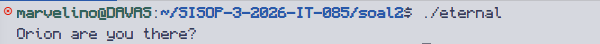

2. Orion berhasil dijalankan (poin 1 - server siap menerima koneksi)


3. Register akun baru berhasil (poin 4 - register dengan username unik)

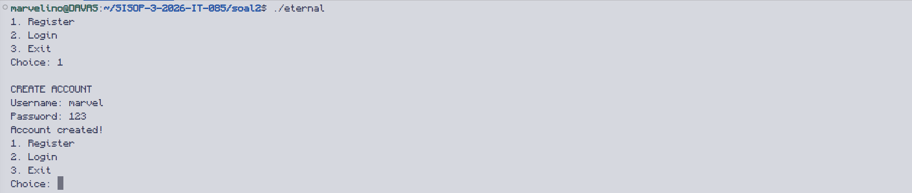

4. Register username yang sudah ada ditolak (poin 4 - username harus unik)

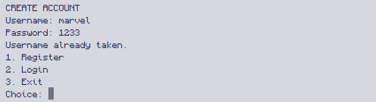

5. Login berhasil dan muncul profile dengan default stats (poin 4 dan 5 - login dan default Gold 150, Lvl 1, XP 0)

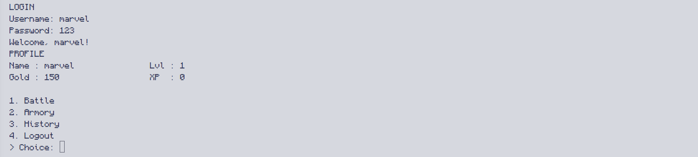

6. Login akun yang sedang aktif ditolak (poin 4 - satu akun tidak bisa login dua kali)

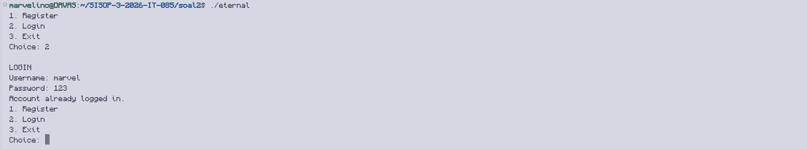

7. Battle real-time antara dua player, HP berkurang di kedua sisi (poin 6 dan 7 - matchmaking dan battle asinkron)

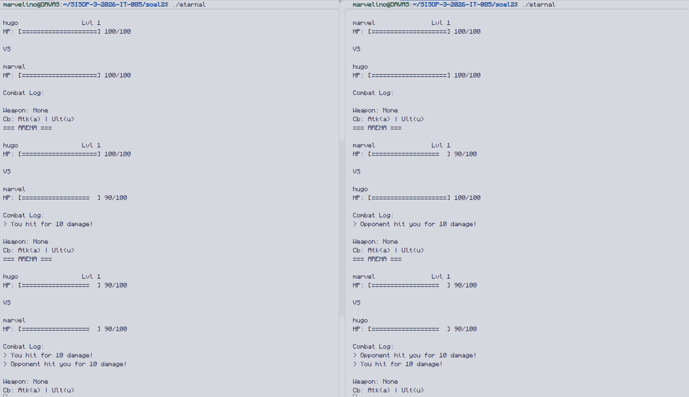

8. Matchmaking countdown dan battle vs bot setelah 35 detik (poin 6 - matchmaking timeout lawan bot)

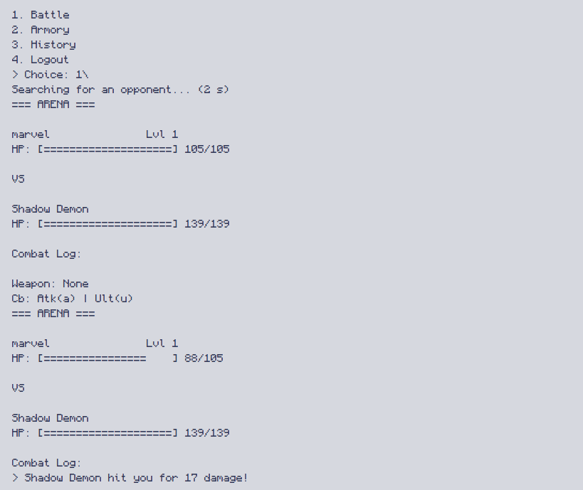

9. Menu armory dan beli senjata, gold berkurang (poin 9 - sistem persenjataan)

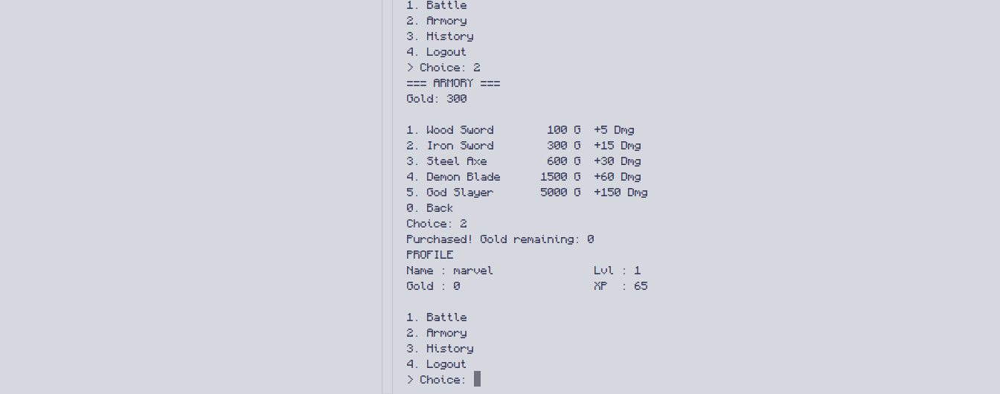

10. Ultimate saat battle dengan damage 3x (poin 7 - ultimate hanya bisa kalau punya senjata)

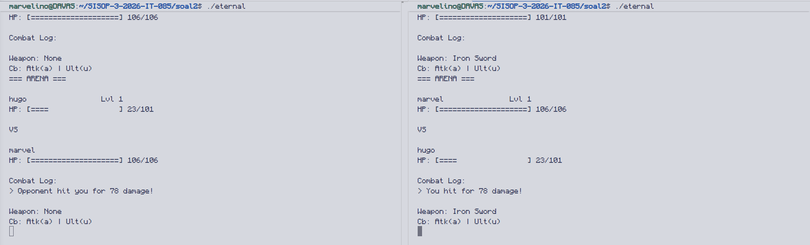

11. Riwayat battle dengan timestamp, lawan, hasil, dan XP (poin 10 - match history)

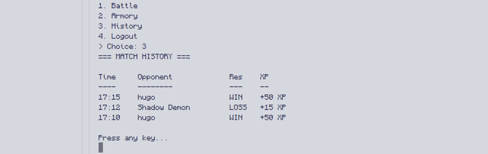

12. Orion direstart tapi stats player tetap sama (poin 4 - data persistent)

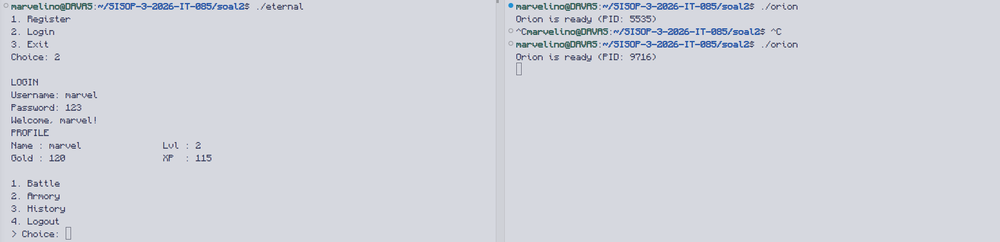

### Kendala

Pengelolaan terminal saat battle memerlukan perhatian khusus karena raw mode harus di-restore setelah battle selesai. Sinkronisasi antara `battle_recv` thread dan main thread memerlukan `pthread_mutex` agar tidak terjadi race condition saat redraw layar battle. Untuk IPC, kalau orion di-kill paksa tanpa Ctrl+C, shared memory dan message queue bisa nyangkut di sistem dan perlu dibersihkan dengan `make clear_ipc`.